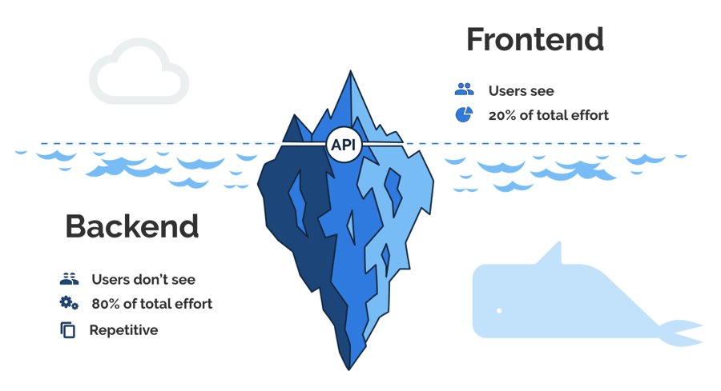
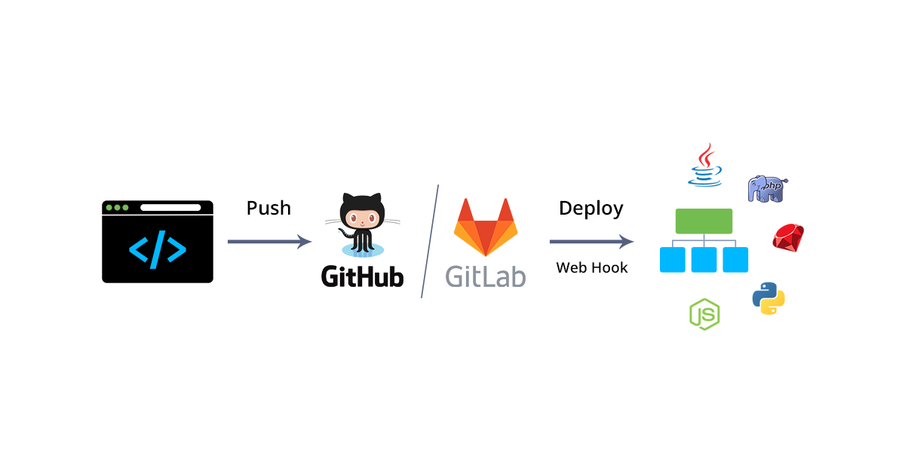
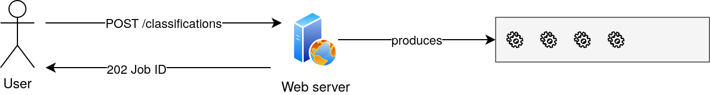
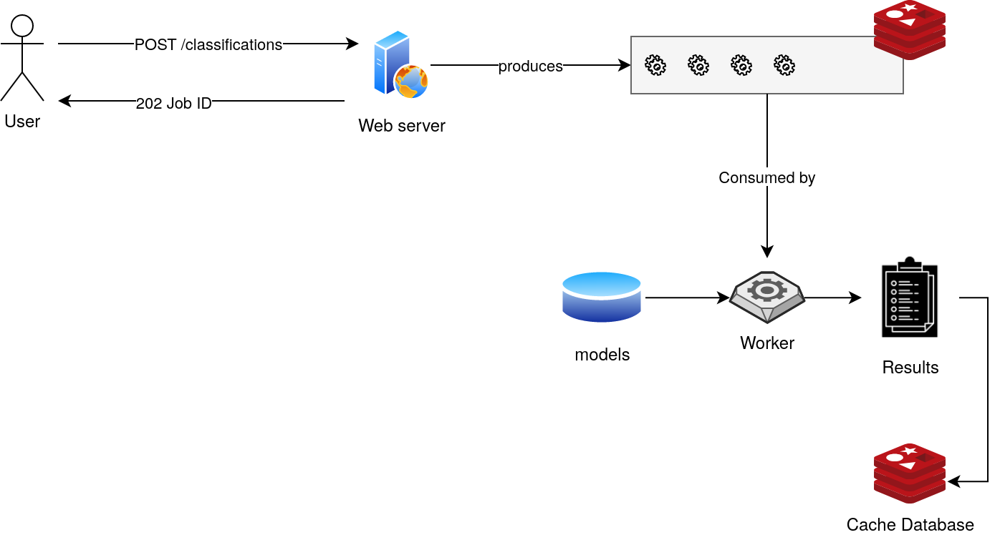
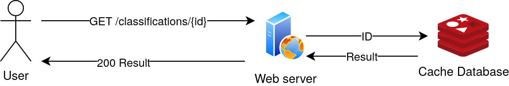
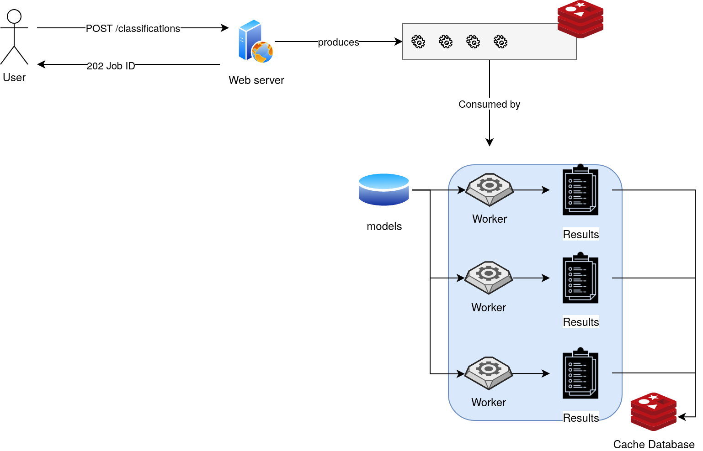
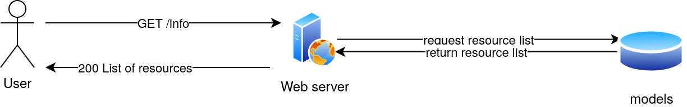
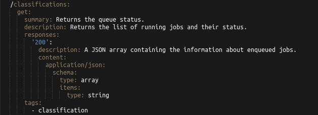
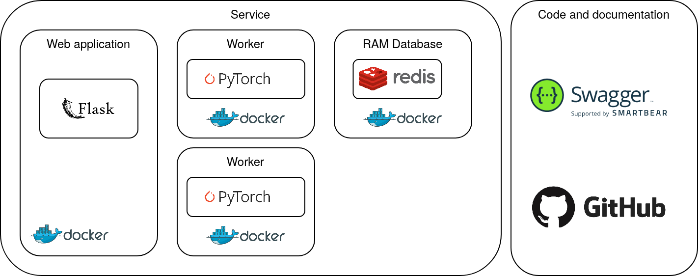

# ISDe course
## Web development
### Maura Pintor - [maura.pintor@unica.it](mailto:maura.pintor@unica.it)

---

What this lesson covers:

Note: we are not going to start from scratch. We are going to clone a 
repository that contains the structure of our code.

What we have:
* requirements
* the definition of the APIs that we need to implement
* the code for the classifier is already written, we are going to use it 
as a **black box**. This means that we know what is the input and the expected 
output, but we are not going to look inside the code.

---

## Part 0 : Web servers basics

---

### Web server for the user


More info [here](https://en.wikipedia.org/wiki/Web_server).

---

### Web server for the developer



More info [here](https://en.wikipedia.org/wiki/Front_and_back_ends).

---

### API

[](https://www.youtube.com/watch?v=s7wmiS2mSXY)

More info [here](https://en.wikipedia.org/wiki/Application_programming_interface).

---

### HTTP


More info [here](https://en.wikipedia.org/wiki/Hypertext_Transfer_Protocol).

---

### The language of web servers


---

### Localhost


More info [here](https://en.wikipedia.org/wiki/Localhost).

---

### Deployment



deploy resources = make them ready to be used


## Part 1: Define the service

First, we have to define what we want to build. Our **requirements** are: 

* **a web app (frontend) that runs a simple ML algorithm for image classification (backend)**
* inside a container - don't worry about it now
* time constaint (always take into account)

### Before start writing the code ...

This is an important part of our development process. We can start writing code 
right away, but the risk is that if we don't have the right start we might have 
to rewrite the code many times. It is better to take a moment to think about 
the structure of our application. 

#### Use cases and architecture

The user should be able to send a request for an image classification job. 
A thing that we want to consider is that the user expects a quick response 
from the server. Remember, it's not necessary to provide the result already, 
but we need to tell the user we heard him. If we don't do so, the user might 
get annoyed (in the meanwhile the server cannot respond because it is running 
the job) and send multiple requests. We want to avoid that.

What is the solution? We should use **asyncronous** jobs. We create a **queue**, 
save the request, and send the results back to the user when they are 
ready. We will use a simple database for handling the queue.



The webserver enqueues the job and returns to the user a "ticket" for 
getting the results, when they are ready. The "ticket" will be the 
ID of the job.

The worker, another service of our webserver, takes the enqueued jobs 
with a FIFO (First-In-First-Out) schedule, processes the requests, and 
stores the results in redis, with the job ID as Key for accessing the 
newly-produced data.



After some (short) time, the user should be able to send a request to 
the server, providing the job id, and getting the results as a response.



What is the advantage of having modularity and forcing ourselves to 
separate every component? It will be easier, if we have too many requests, 
to scale up the services!



Finally, it is important to provide help for the user in order to allow 
exploration of the service. We might want to implement an additional API 
that returns the list of possible resources available. We will keep it 
simple and just store a list of all models and images available in our 
server.



---

# Did you notice?
We haven't even named a single software until now... For what is worth, 
our application might not even be written in Python! Before diving into 
tools for building our server, it is important to know what tools can help 
us design and maintain our code.

---

### Tools for developers

* [Swagger](https://swagger.io/): tool for designing and **documenting** APIs, 
using the [Open API specifications](https://www.openapis.org/). 
* [GitHub](https://github.com/): service that hosts the versioned source code of
our application.

We are not going to write the API definition in swagger, but this is how 
they look like:


And [here](https://app.swaggerhub.com/apis-docs/Maupin1991/ml-server/1.0#/) 
we can find the APIs we have to create, rendered by Swagger.

---

### Building blocks

Now we can finally choose the building blocks of our application.

**shopping list**
* a "box"
* a web server
* something for storing the queue
* some worker that will process the requests
* some storage (so that we can keep the resources locally instead of 
  downloading them every time)


---

**shopping list**
* [Docker](https://www.docker.com/) (a "box")
* [Flask](https://flask.palletsprojects.com/en/1.1.x/) (a web server)
* [Redis](https://redis.io/) (something for storing the queue)
* Python + [Pytorch](https://pytorch.org/) (some worker that will process the requests)



---

This seems a very complicated architecture, but we are lucky! Docker 
has the perfect tool for this!
[Docker-compose](https://docs.docker.com/compose/) allows to define a 
"map" of our service, including several containers that can be interconnected 
through open ports.

---

Now that we have a rough idea of what are the steps, we can start writing 
some code!

---

## Part 2: Getting started with the code

Download the repository (run a terminal in the directory where you 
want to download it, or `cd` into that from your home directory): 

```shell script
git clone https://github.com/maurapintor/flask-classification.git
```

First, we will try and run the server locally. We can just run the script 
`runserver.py` and see what happens.

```text

 * Running on http://0.0.0.0:5000/ (Press CTRL+C to quit)

```

This is a simple Python server running **locally** on our computer. This 
means that there is a service that is listening in the localhost address 
(0.0.0.0), port 5000, waiting for HTTP requests.

---

Let's explore the code repository. It's a good practice to start from the 
`Readme.md` file and the `requirements.txt`. These are files that describe 
what the repository is for, and what is needed to run it. 
The requirements file is like a shopping list. We can install all the 
libraries we need by typing: 

```shell script
pip install -r requirements.txt
```

---

Then, we can explore the `app` directory. We are not covering all the 
code in this lesson, but [here](https://maurapintor.github.io/files/web-servers.pdf) 
there is a tutorial about web servers with Flask.

---

For this lesson, we are interested in the following packages:

* `app/routes`: where we have to write the code for our APIs
* `app/ml`: the code for running the machine learning tasks. We have 
to read and understand how to use this code for running our classification 
service.
* `app/utils`: here we can find utilities that can help us build our APIs.
* `app/forms`: these are forms that can be used for asking specific 
questions (which model? which image?) to the user. We will implement 
this as a drop down menu.

---

We can start by implementing the easiest one: the info api.
Go to `app/routes/info.py`.


---

```python
from app import app
from app.utils.list_images import list_images

from config import Configuration

conf = Configuration()

@app.route('/info', methods=['GET'])
def info():
    """Returns a dictionary with the list of models and 
    the list of available image files."""
    data = dict()
    data['models'] = conf.models
    data['images'] = list_images()
    return data
```

---

Now let's run the server and 
try the url: [http://0.0.0.0:5000/info](http://0.0.0.0:5000/info)

---

Now that we get the idea, we should try and fix the API for 
`app/classifications`. Let's ignore for now the fact that we have to 
build a queue.

---

Let's explore the code in `app/ml/classification_utils.py`.
By reading the docstring (or even just the function name), try to create 
a mental map of what we need in our classification API.

---

First, we have to create a form for the user to submit the request. 
See what we already have in `forms/classification_form.py`. 

---

```python

from flask import render_template

from app import app
from app.forms.classification_form import ClassificationForm


@app.route('/classifications', methods=['GET', 'POST'])
def classifications():
    form = ClassificationForm()
    if form.validate_on_submit():
        image_id = form.image.data
        model_id = form.model.data
        clf_output = ()  # todo get classification output
        result = dict(
            image_id=image_id,
            model_id=model_id,
            data=clf_output)  # ignore this for now
        return dict(image_id=image_id, model_id=model_id)

        # return render_template('classification_output.html', results=result)

    return render_template('classification_select.html', form=form)
```

---

Let's also return our classification output and see what happens:
```python
clf_output = classify_image(model_id=model_id, img_id=image_id)
```

---

The final version of our code should look like this: 

```python

from flask import render_template

from app import app
from app.forms.classification_form import ClassificationForm
from ml.classification_utils import classify_image


@app.route('/classifications', methods=['GET', 'POST'])
def classifications():
    """API for selecting a model and an image and running a 
    classification job. Returns the output scores from the 
    model."""
    form = ClassificationForm()
    if form.validate_on_submit():
        image_id = form.image.data
        model_id = form.model.data
        clf_output = classify_image(model_id=model_id, img_id=image_id)
        result = dict(
            image_id=image_id,
            model_id=model_id,
            data=clf_output)

        return render_template('classification_output.html', results=result)

    return render_template('classification_select.html', form=form)

```

---

Now, if you re-run the server, you should see the list of available 
models and images as a form. We won't inspect how this is rendered in 
the front-end, but of course remember that we created a form object 
that is passed through the Flask APIs to the HTML file we are 
rendering with the instruction "render_template".

---

If we click on submit, the classification output should appear in our 
browser as a table with the top 5 scores.

---

What happens if we get many requests? What happens if the classification 
takes too long to process?

If we don't send a response to users in a short time, they can get 
bored with our service, or worse, send more requests!

---

The solution: implement a task queue.

Whenever the user sends a request, the server returns a status code. 
The web browser then can request the resource after a certain amount 
of time, and check the status of the queue.

---

This pattern is called [polling](http://restalk-patterns.org/long-running-operation-polling.html), 
and is a mechanism that allows Asynchronous long running operations with 
the REST APIs.

---

First, we have to create a queue. We can do so in our classifications 
handler, and enqueue the jobs as soon as they are requested by users.

---


```python
import redis
from flask import render_template
from rq import Connection, Queue
from rq.job import Job

from app import app
from app.forms.classification_form import ClassificationForm
from ml.classification_utils import classify_image
from config import Configuration

config = Configuration()


@app.route('/classifications', methods=['GET', 'POST'])
def classifications():
    """API for selecting a model and an image and running a 
    classification job. Returns the output scores from the 
    model."""
    form = ClassificationForm()
    if form.validate_on_submit():
        image_id = form.image.data
        model_id = form.model.data
        redis_url = config.REDIS_URL
        redis_connection = redis.from_url(redis_url)
        with Connection(redis_connection):
            q = Queue(name=config.QUEUE)
            job = Job.create(classify_image, kwargs=dict(model_id=model_id,
                                                         img_id=image_id))
            task = q.enqueue_job(job)
        return render_template('classification_output_queue.html', image_id=image_id, jobID=task.get_id())

    return render_template('classification_select.html', form=form)
```

---

```python

import redis
from rq import Connection, Queue

from app import app
from config import Configuration

config = Configuration()

@app.route('/classifications/<string:job_id>', methods=['GET'])
def classifications_id(job_id):
    redis_url = config.REDIS_URL
    redis_connection = redis.from_url(redis_url)
    with Connection(redis_connection):
        q = Queue(name=config.QUEUE)
        task = q.fetch_job(job_id)

    response = {
        'task_status': task.get_status(),
        'data': task.result,
    }
    return response
```

---

Now, we should run the worker and the server together.
See also the output that they produce.
 
**What is happening**

* **frontend (html + javascript)**: the user requests the webpage.
* **backend(python)**: the server returns the html with the image and 
model selection.
* **frontend (html + javascript)**: the user picks the model and the 
image. The web browser issues the request to the backend server.
* **backend(python)**: the server receives the request, 
creates a task, and puts the task in the queue. Returns the id of 
the stored job to the browser that issued the request. The server 
redirects the browser to the results page.
* **frontend (html + javascript)**: the web browser renders the 
result page and asks for the job result with the id as parameter. If 
the status of the job is "success", the server renders the resulting 
output, otherwise it renders a temporary screen.

In the meanwhile...

* **the worker(python)**: The worker takes the 
tasks from the queue and processes them, storing the result in the 
database. The result is accessible by the id of the job.

---

This service works, but of course this is not the only requirement. 
Aside from the other requirements that we may have, we have always to 
add the "implicit" requirements of security, stability and documentation.

For example, we should handle a request to a job id not existent, or to 
a job that has the result "failed"...
All the possible exceptions should terminate the request "gracefully". 
With flask, it is also possible to set specific renderings for typical 
HTTP error codes.

We won't take care of it for now, but you are free to use it as practice!

--- 

## Containers

---

* volume - prepare
* scale up workers


