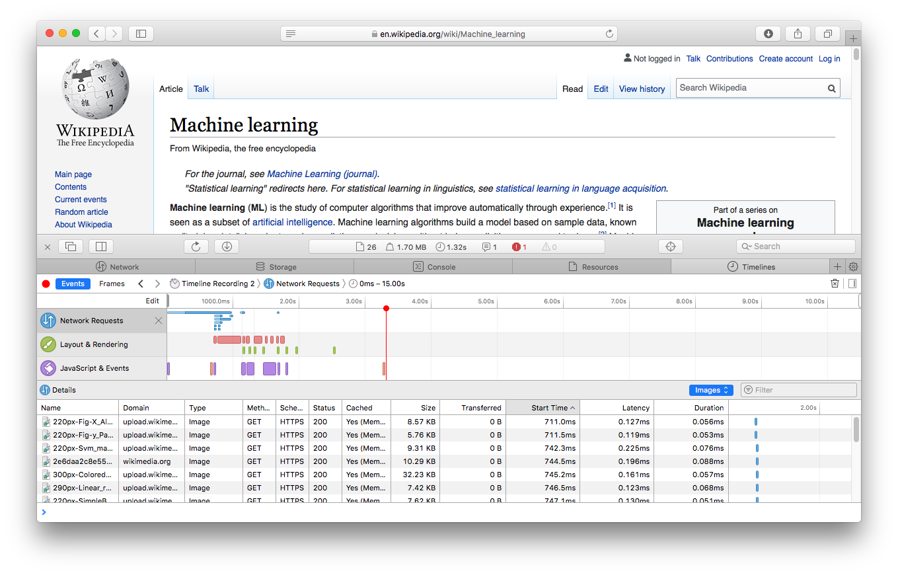
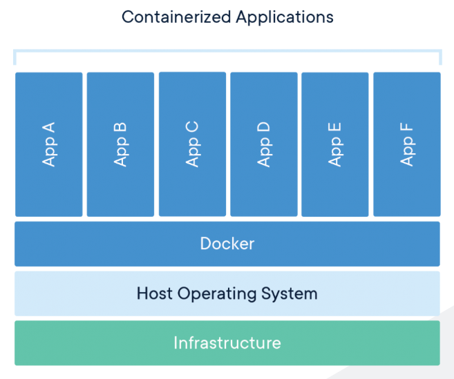
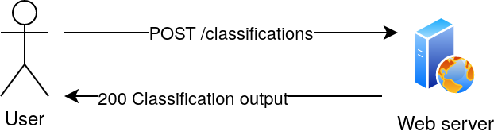

# ISDe course
## Web development
### Maura Pintor  
[maura.pintor@unica.it](mailto:maura.pintor@unica.it)

---

What this lesson covers:

* designing APIs
* inspecting code written by others
* implementing a few basic APIs
* creating a container
* creating an architecture with isolated components
* scaling 

---

Let's imagine a scenario:

> We are a team of developers in a company. 
>
> We have to build a demo.
>
> The demo should present our product of image classification.

---


The code for the classifier is already written as it is a product 
of our company, we are going to use it 
as a **black box**. 


---

We are not going to start from scratch. 

The team has a repository that contains already some code.

---

## Part 0 : Basics

### Web servers, image classification, and containers

---

# Web servers

---

### Web server for the user


More info [here](https://en.wikipedia.org/wiki/Web_server).

[Example of webserver](https://en.wikipedia.org/wiki/)

---

### Web server for the developer

<!-- .element height="70%" width="70%" -->

More info [here](https://en.wikipedia.org/wiki/Front_and_back_ends).

---

### API


<iframe width="560" height="315" src="https://www.youtube.com/embed/s7wmiS2mSXY" frameborder="0" allow="accelerometer; autoplay; clipboard-write; encrypted-media; gyroscope; picture-in-picture" allowfullscreen></iframe>

[Open video](https://www.youtube.com/embed/s7wmiS2mSXY)

More info about [APIs](https://en.wikipedia.org/wiki/Application_programming_interface).

---

### HTTP


More info on [HTTP Protocol](https://en.wikipedia.org/wiki/Hypertext_Transfer_Protocol).

---

### The language of web servers


---



---

### Localhost


More info [here](https://en.wikipedia.org/wiki/Localhost).

---

### Deployment

<!-- .element height="60%" width="60%" -->

deploy resources = make them ready to be used

We will not deploy our application for this tutorial.

---

# Image classification

---

## Image classification

<!-- .element height="60%" width="60%" -->

Want to know more? Check out this tutorial on 
[image classification with PyTorch](https://pytorch.org/tutorials/beginner/blitz/cifar10_tutorial.html).

---

# Containers 

---

## Containers

  <!-- .element height="40%" width="40%" -->

Some information about [containers](https://medium.com/@Edge2Ops/introduction-to-containers-b39a6559e054).

Not only [Docker](https://github.com/containers/)...

---

## Part 1: Define the service

### First, we have to define what we want to build. 

---

Our **requirements** are: 

* **a web app that runs a simple ML algorithm for image classification.**
* inside a **container** - don't worry about it now
* **time constaint** (always take into account)

---

### Before start writing any code ...

This is an important part of our development process. If we rush 
into writing the code, the risk is to waste time. 

Better stop and take a moment to think what is the 
structure of our application.

---

### Use cases

The user should be able to classify an image.
 


What can the user change? What is fixed?

We decide that the user can only choose a specific model and 
a specific image from a set of models and a set of images. 
<!-- .element: class="fragment" -->

---

### Modern ML systems are very fast but...

What if classifying the image takes longer? 
<!-- .element: class="fragment" -->

What could go **wrong** in our demo?
<!-- .element: class="fragment" -->

---

### The user expects a quick response

It's not necessary to provide the result already, 
but we need to tell the user we heard him. 

Otherwise, the user might get annoyed and send multiple requests. 
<!-- .element: class="fragment" -->

We want to avoid that.
<!-- .element: class="fragment" -->

What is the solution? 
<!-- .element: class="fragment" -->

---

The webserver enqueues the job and returns to the user a **"ticket"** for 
getting the results. 
The "ticket" will be the ID of the job.


---

We will implement **asyncronous** jobs. 

We create a **queue**, 
save the request, and store the results when they are 
ready. We will use a simple database for handling the queue.


---

The **worker**, another service of our webserver, takes the enqueued jobs 
with a **FIFO** (First-In-First-Out) schedule, and processes the requests.

---

Once completed, each job result is stored 
in the database, with the job ID as Key for accessing the 
newly-produced data.

---


---

After some (short) time, the user should be able to send a request to 
the server, providing the job id, and getting the results as a response.


---

What are the advantages of enforcing **modularity**?
* failures are isolated to single components
* scaling is easier

---


---

We can still make another improvement: pre-downloading the images and 
the models. 

What pieces of our architecture should be able to access them?<!-- .element: class="fragment" -->


---

# Notice something...
We haven't even named a single software until now... For what is worth, 
our application might not even be written in Python!

---

Now we can introduce tools can help 
us design and maintain our code.

... Still no code yet!

---

### Tools for developers

* [GitHub](https://github.com/): service that hosts the versioned source code of
our application.
* [Swagger](https://swagger.io/): tool for designing and **documenting** APIs, 
using the [Open API specifications](https://www.openapis.org/). 

---

We are not going to write the API definition in swagger, but this is how 
they look like:


This is written in [YAML](https://en.wikipedia.org/wiki/YAML). We will see 
another one in this lesson.

---

And [here](https://app.swaggerhub.com/apis-docs/Maupin1991/ml-server/1.0#/) 
we can find the APIs we have to create, rendered by Swagger.

---

## Now we can start creating our building blocks

---

### Building blocks

* a "box" <!-- .element: class="fragment" -->
* a web server <!-- .element: class="fragment" -->
* a queue<!-- .element: class="fragment" -->
* some worker<!-- .element: class="fragment" -->
* some storage<!-- .element: class="fragment" -->


---

### Building blocks (with a name)

* [Docker](https://www.docker.com/) (a "box")
* [Flask](https://flask.palletsprojects.com/en/1.1.x/) (a web server)
* [Redis](https://redis.io/) (a queue)
* Python + [PyTorch](https://pytorch.org/) (some worker)
* [Docker volumes](https://docs.docker.com/storage/volumes/) (some storage)

---


---

This seems a very complicated architecture, but we are lucky! Docker 
has the perfect tool for this!

[Docker-compose](https://docs.docker.com/compose/) interconnects 
several containers through APIs.

---

Now that we have a rough idea of what are the steps, we can start writing 
some code!

---

## Part 2: Getting started with the code

---

Download the repository (run a terminal in the directory where you 
want to download it, or `cd` into that from your home directory): 

```shell script
git clone https://github.com/maurapintor/flask-classification.git
```

---

Let's explore the code repository. It's a good practice to start from the 
`Readme.md` file and the `requirements.txt`. These are files that describe 
what the repository is for, and what is needed to run it. 

---

The requirements file is like a shopping list. We can install all the 
libraries we need by typing: 

```shell script
pip install -r requirements.txt
```

---


First, we will try and run the server locally. We can just run the script 
`runserver.py` and see what happens.

```text

 * Running on http://0.0.0.0:5000/ (Press CTRL+C to quit)

```

This is a simple Python server running **locally** on our computer. This 
means that there is a service that is listening in the localhost address 
(0.0.0.0), port 5000, waiting for HTTP requests.

---

Then, we can explore the `app` directory. We are not covering all the 
code in this lesson. If you are interested, [here](https://maurapintor.github.io/files/web-servers.pdf) 
you can find a tutorial about web servers with Flask.

---

These are the package of main interest for this lesson

* `app/routes`: our APIs are defined here
* `app/utils`: utilities for building our APIs
* `app/forms`: these are forms that can be used for asking specific 
questions (which model? which image?) to the user. We will implement 
this as a drop down menu

---

* `ml`: here we can find the code for running the machine learning tasks. 
We have to read and understand how to use this code for running our 
classification service.

---

Take a moment to get familiar with the repository.

---

As a first exercise, we will implement an easy one. 

We want to the API 
that returns the list of possible resources available. 

---

We will keep it 
simple and just store a list of all models and images available in our 
server.


---

We can start by implementing the easiest one: the info api.
Go to `app/routes/info.py`.


---


---

### This is the implemented API

```python
from app import app
from app.utils.list_images import list_images

from config import Configuration

conf = Configuration()
```

```python

@app.route('/info', methods=['GET'])
def info():
    """Returns a dictionary with the list of models and 
    the list of available image files."""
    data = dict()
    data['models'] = conf.models
    data['images'] = list_images()
    return data
```

---

Now let's run the server and 
try the url: [http://0.0.0.0:5000/info](http://0.0.0.0:5000/info)

---

Now that we get the idea, we should try and fix the API for 
`app/classifications`. 

Let's ignore for now the fact that we have to 
build a queue.

---

Let's explore the code in `ml/classification_utils.py`.

By reading the docstring (or even just the function name), try to create 
a mental map of what we need in our classification API.

---

First, we have to define a form for the user to submit the request. 


See what we already have in `app/forms/classification_form.py`. 
<!-- .element: class="fragment" -->

---

---

We should get the classification output with our machine learning 
utilities: 

```python
clf_output = classify_image(model_id=model_id, img_id=image_id)
```

---

The final version of our code should look like this: 

```python
from flask import render_template

from app import app
from app.forms.classification_form import ClassificationForm
from ml.classification_utils import classify_image
```

```python

@app.route('/classifications', methods=['GET', 'POST'])
def classifications():
    form = ClassificationForm()
    if form.validate_on_submit():
        image_id = form.image.data
        model_id = form.model.data
        clf_output = classify_image(model_id=model_id, 
                                    img_id=image_id)
        result = dict(image_id=image_id,model_id=model_id,
                      data=clf_output)
        return render_template('classification_output.html', 
                               results=result)
    return render_template('classification_select.html', 
                           form=form)
                

```

---

Now try it on the server. 

---

We won't inspect the front-end in detail, 
but remember that we created a **form object** 
that is passed through the **Flask APIs** to the HTML file we are 
rendering with the instruction `render_template`.

---

If we click on submit, the classification output should appear in our 
browser as a table with the top 5 scores.

---

What happens if we get many requests? What happens if the classification 
takes too long to process?

If we don't send a response to users in a short time, they can get 
bored with our service, or worse, send more requests!<!-- .element: class="fragment" -->

---

We can simulate a long running task by adding a line 
in the classification function. 

```python
import time
time.sleep(5)
```

---

The solution: implement a task queue.

---

Whenever the user sends a request, the server returns a status code. 
The web browser then can request the resource after a certain amount 
of time, and check the status of the queue.

---

This pattern is called [polling](http://restalk-patterns.org/long-running-operation-polling.html), 
and is a mechanism that allows Asynchronous long running operations with 
the REST APIs.

---

First, we have to create a queue. We can do so in our classifications 
handler, and enqueue the jobs as soon as they are requested by users.

---

Let's edit `app/routes/classifications.py`

---

---


```python
import redis
from flask import render_template
from rq import Connection, Queue
from rq.job import Job
...
@app.route('/classifications', methods=['GET', 'POST'])
def classifications():
    ...
    if form.validate_on_submit():
        ...
```

```python
        redis_url = config.REDIS_URL
        redis_connection = redis.from_url(redis_url)
        with Connection(redis_connection):
            q = Queue(name=config.QUEUE)
            job = Job.create(classify_image, 
                             kwargs=dict(model_id=model_id,
                                         img_id=image_id))
            task = q.enqueue_job(job)
        return render_template('classification_output_queue.html', 
                               image_id=image_id, 
                               jobID=task.get_id())
    ...
```

---

Notice that the HTML form that we are using has a `<script>` tag, which 
is running a `JavaScript` fragment. We are not going to edit that, 
but I will tell you what it is going on...

---

The script is run at the first time when the HTML is rendered. Inside 
that, we have a polling mechanism that keeps asking for the 
resource `/classfications/{JobID}` every second, until the output 
JSON of the API says `"status": "success"`.

---

Now we should return that status and eventually the job 
result in our `app/classifications_id.py` file.

---

```python

import redis
from rq import Connection, Queue
from app import app
from config import Configuration

config = Configuration()

@app.route('/classifications/<string:job_id>', methods=['GET'])
def classifications_id(job_id):
    redis_url = config.REDIS_URL
    redis_connection = redis.from_url(redis_url)
    with Connection(redis_connection):
        q = Queue(name=config.QUEUE)
        task = q.fetch_job(job_id)
```

```python
    response = {
        'task_status': task.get_status(),
        'data': task.result,
    }
    return response
```

---

Now, we should run the worker and the server together.
See also the output that they produce.

---
<!-- .slide: style="text-align: left;"> -->  
 
#### What is happening (1/3):

**frontend (html + javascript)**: the user requests the webpage.
<!-- .element: class="fragment" -->

**backend(python)**: the server returns the html with the image and 
model selection.
<!-- .element: class="fragment" -->

**frontend (html + javascript)**: the user picks the model and the 
image. The web browser issues the request to the backend server.
<!-- .element: class="fragment" -->

---
<!-- .slide: style="text-align: left;"> -->  

#### What is happening (2/3):

**backend(python)**: the server receives the request and puts the 
task in the queue. Returns the id of 
the stored job to the browser and redirects to the results page.
<!-- .element: class="fragment" -->

**frontend (html + javascript)**: the web browser renders the 
result page and asks for the job result. If 
the status of the job is "success", 
the server renders the resulting 
output, otherwise it waits and repeat.
<!-- .element: class="fragment" -->

---
<!-- .slide: style="text-align: left;"> -->  

#### What is happening (3/3):

In the meanwhile...

**the worker(python)**: The worker takes the 
tasks from the queue and processes them, storing the result in the 
database.
<!-- .element: class="fragment" -->

---

This service _works_, but of course this is not the only requirement. 

Depending on the application, we have always to 
add the "implicit" requirements like security, stability and documentation.

---

## Containers

---

For creating a container with Docker, we use a specific 
file called `Dockerfile`. This file is automatically 
understood by Docker and it has a specific format. 

We are not going to write one from scratch, 
but we can inspect the one that builds our application.

---

```dockerfile
FROM python:3.7

# We copy just the requirements.txt first to leverage 
# Docker cache
COPY ./requirements.txt /app/requirements.txt

WORKDIR /app

RUN pip install -r requirements.txt

ADD . ./

CMD ["python", "runserver.py"]

```

---

The important part here is to remember that: 
 
* we are starting from an image that already contains Python and 
some other useful tools, *e.g.*, `pip`.

* we are leveraging Docker cache.

---
 
### Docker cache

Docker builds **intermediate 
containers** for every line we have in this Dockerfile. 

If we change the content of one of the lines, Docker uses the cached 
version of everything before the changed line and rebuilds what 
comes after the line.

<!-- .element height="30%" width="30%" -->

---

### Building the container

Now let's open a terminal in the root directory, and run:

```shell script
docker build . -t classification-ws
```

We are telling Docker to build the current 
directory, and to **tag** 
the image we just created with the name `classificaion-ws`.

Docker will automatically search for a file `Dockerfile` in the 
specified directory.

---

If you haven't done it yet, remember to stop the webserver that we 
were using until now. This is because we will run the same service 
through the docker container now!

---

Then, we can run the container with the command:

```shell script
docker run -p 5000:5000 classification-ws
```

Note that we are specifying here a **socket**. This is a mapping 
of a port inside the container with a port in our computer. 

So, inside our container we will run the server on port 5000, which 
will be linked with the port 5000 of our localhost.

---

We can see that the container is running the server in our [localhost 
port 5000](http://localhost:5000).

Don't run classifications there yet...

---

We should improve our docker service a little bit, right now it is 
missing the redis service, the volume, and the worker. If we ask for 
a classification job now, we will be stuck with an error...

---

Stop the container with Ctrl+C.

---

## Docker compose

---

Remember the architecture? See how many containers are there:


---

See how many containers are there now...
* one for the web application
* one for each worker
* one for the redis database

---

If we want to define more than one container and link them 
together, we should use a docker compose file. 
We have one already in our root-directory. Let's inspect that.

---

We have three blocks:
* web
* redis
* worker

---

```yaml
web:
  build: .
  command: python runserver.py
  ports:
    - "5000:5000"
  links:
    - redisdb
  environment:
  - REDIS_HOST=redisdb
  - REDIS_PORT=6378
  volumes:
    - ~/.cache/torch:/root/.cache/torch
```

---

The `web` container is running the webserver on port 5000. It 
has a `build .` command that is similar to what we just did 
with the standalone container, and some other interesting keywords.

---

**links** defines the connection of this container with others 
defined in the same dockerfile. We are connecting this container 
with the one running the database

---

**environment** defines environment variables, that we can use 
for storing dynamic values like the redis port and the hostname. 
Why is the hostname `redisdb`?

---

By default, docker links define an entry in the hosts file of 
our containers that points to the linked containers. So if we connect 
to `resdisdb` from inside of our `web` container, we will see 
the localhost of the `redisdb` container.

---

**volumes** is another interesting trick. We are mounting a 
directory from our **filesystem** into the container's filesystem.
This means that the files located here persist even when the container 
is stopped. 

We are using this trick to avoid downloading models every 
time we run the container. 

---

Now check the remaining parts of the docker-compose file. You should 
now be able to understand them.

---

```yaml
redisdb:
  image: "redis"
  command: --port 6378
  ports:
    - "6378:6378"
```

---

```yaml
worker:
  build: .
  command: python worker.py
  links:
    - redisdb
  environment:
  - REDIS_HOST=redisdb
  - REDIS_PORT=6378
  volumes:
    - ~/.cache/torch:/root/.cache/torch
```

---

And finally, let the magic happen! We can create our architecture 
with a single line:

```shell script
docker-compose build && docker-compose up
```

---

What is the beauty of our docker compose? First, 
we can download the whole repository and install it 
in the client's computer without sweating too much...

---

Moreover, we can also easily scale our service, for example 
by running 2 workers instead of one!

```shell script
docker-compose up --scale worker=2
```

---

There are other improvements that can be easily implemented with 
this architecture. Can you figure out them?

* scale web container and add load balancer<!-- .element: class="fragment" -->
* caching machine learning results<!-- .element: class="fragment" -->

---

# Summary

---
<!-- .slide: style="text-align: left;"> -->  

### Summary

* design phase of a project
* frontend-backend
* APIs
* long running jobs and queues
* containers

Questions? Send them to [maura.pintor@unica.it](mailto:maura.pintor@unica.it)
